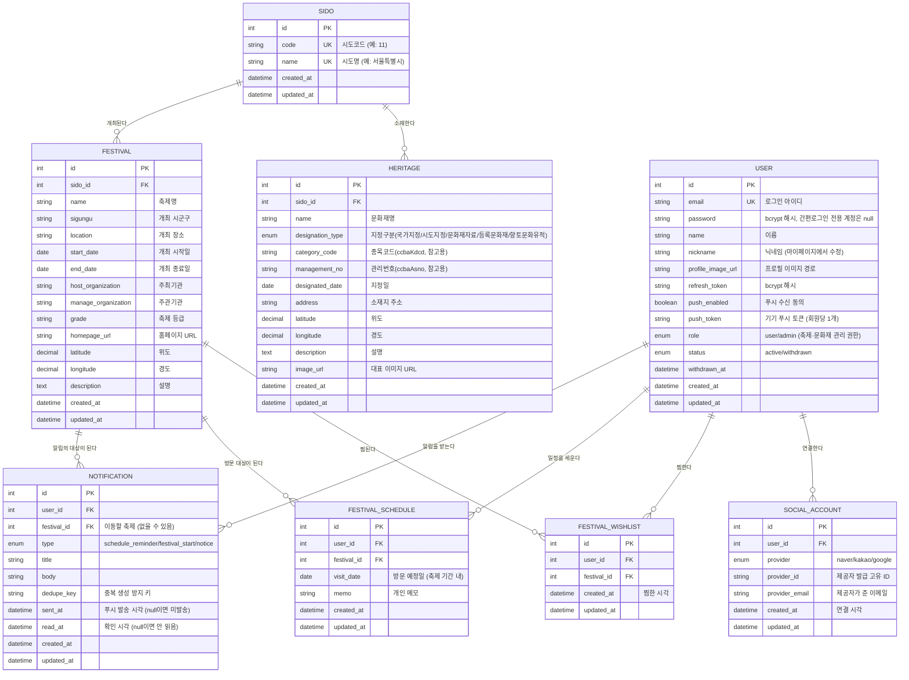
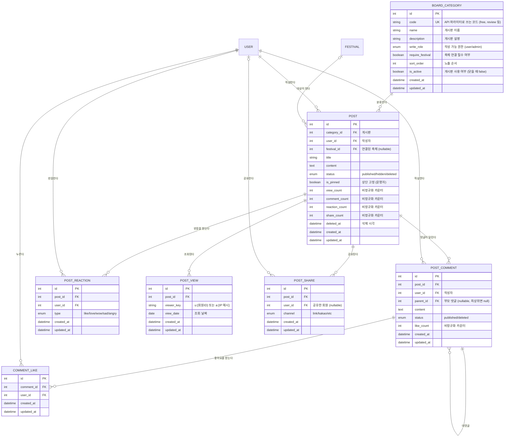

# Project Heritage - ERD

`data.go.kr` 공공데이터포털의 **전국 지정문화재 현황**, **전국문화축제표준데이터** 등의 필드 구성을
참고하여 설계한 데이터베이스 구조입니다. (참고: 국가유산청 Open API 시도코드 `ccbaCtcd`)

- **Sido**: 광역시도 마스터 (국가유산청 Open API 시도코드 기준 17개 고정 데이터)
- **Heritage**: 문화재(국가유산) 정보
- **Festival**: 지역축제 정보
- **User**: 회원 (인증/마이페이지 도메인, 문화재/축제와 직접적인 FK 관계는 없음)
- **SocialAccount**: 회원에 연결된 간편로그인(카카오/네이버/구글). 회원 1명이 여러 개를 연결할 수 있다.
- **FestivalWishlist**: 회원이 찜한 축제 (날짜 없는 북마크)
- **FestivalSchedule**: 회원의 축제 방문 일정 (방문일 + 메모)
- **Notification**: 회원에게 보낸 알림 이력 (방문 하루 전 리마인더 등)

커뮤니티(게시판) 도메인:

- **BoardCategory**: 게시판 마스터 (공지/자유/후기/동행/질문). ENUM이 아닌 테이블이다.
- **Post**: 게시글. 축제와 선택적으로 연결된다.
- **PostComment**: 댓글 및 대댓글 (자기 참조, 깊이 1단계)
- **PostReaction**: 게시글 반응. 좋아요와 공감을 하나로 합친 테이블이다.
- **CommentLike**: 댓글 좋아요
- **PostView**: 조회 로그 (조회수를 하루 1회만 세기 위한 것)
- **PostShare**: 공유 로그

이 문서는 **읽기용 다이어그램**이고, 실제 스키마의 기준은 `src/migrations/`의 마이그레이션 파일입니다.
모델과 마이그레이션이 어긋나면 `npm test`가 실패하므로 셋은 항상 같은 상태를 유지합니다.

GitHub에서는 아래 Mermaid 코드 블록이 다이어그램으로 자동 렌더링됩니다.

## 관계 설명

| 관계 | 설명 |
| --- | --- |
| Sido 1 : N Heritage | 하나의 시도에 여러 문화재가 소속된다. |
| Sido 1 : N Festival | 하나의 시도에서 여러 지역축제가 개최된다. |
| User 1 : N SocialAccount | 회원 1명이 카카오/네이버/구글을 각각 연결할 수 있고, 마이페이지에서 개별 해지가 가능하다. 회원 삭제 시 연결 정보도 함께 삭제(CASCADE)된다. |
| User N : M Festival (Wishlist) | 회원이 축제를 찜한다. FestivalWishlist가 교차 테이블 역할을 하며, 회원/축제 삭제 시 함께 정리된다. |
| User N : M Festival (Schedule) | 회원이 축제 방문 일정을 세운다. 같은 축제를 여러 날 방문할 수 있어 방문일까지 포함해 유일성을 판단한다. |
| User - Heritage | 현재 직접적인 연관관계는 없다. (추후 문화재 즐겨찾기 등으로 확장 가능) |

### 위시리스트 / 일정 제약 조건

| 제약 | 목적 |
| --- | --- |
| `uq_wishlist_user_festival` (user_id + festival_id) | 같은 축제를 중복으로 찜하는 것을 방지 |
| `uq_schedule_user_festival_date` (user_id + festival_id + visit_date) | 같은 축제를 같은 날짜로 중복 등록하는 것을 방지 |
| `idx_schedule_user_visit_date` (user_id + visit_date) | 내 일정을 기간으로 조회할 때 사용 |
| `uq_notification_user_dedupe` (user_id + dedupe_key) | 배치 재실행 시 같은 알림이 중복 생성되는 것을 방지 |
| `idx_notification_user_created` (user_id + created_at) | 알림함을 최신순으로 조회할 때 사용 |

> 위시리스트는 "가보고 싶다"는 날짜 없는 북마크, 일정은 "언제 갈지" 정해진 계획이라
> 서로 다른 질문에 답하므로 테이블을 분리했습니다.
> 일정의 `visit_date`는 애플리케이션 레벨에서 해당 축제의 개최 기간 안에 있는지 검증합니다.

### SocialAccount 제약 조건

| 제약 | 목적 |
| --- | --- |
| `uq_social_provider_provider_id` (provider + provider_id) | 하나의 SNS 계정이 여러 회원에게 중복 연결되는 것을 방지 |
| `uq_social_user_provider` (user_id + provider) | 한 회원이 같은 제공자를 중복 연결하는 것을 방지 |

> 연결 해지 시 서버는 "비밀번호가 없고 남은 SNS 연결이 1개뿐인" 경우를 거부해,
> 로그인 수단이 모두 사라져 계정에 접근하지 못하게 되는 상황을 막습니다.

## 커뮤니티(게시판)

일반 게시판이 아니라 **축제와 연결되는 게시판**입니다.
`posts.festival_id`가 선택적 FK라서, 축제 상세 화면에 "이 축제 후기"를 붙이고
대시보드에 "지금 이야기가 많은 축제"를 낼 수 있습니다. 자유 글은 이 값이 `NULL`입니다.

### 커뮤니티 제약 조건

| 제약 | 목적 |
| --- | --- |
| `uq_reaction_user_post` (user_id + post_id) | 한 회원은 한 글에 반응을 **하나만** 남긴다. 이 제약이 곧 "반응은 1인 1표" 정책이다 |
| `uq_comment_like_user_comment` (user_id + comment_id) | 같은 댓글에 좋아요를 중복으로 누르는 것을 방지 |
| `uq_post_view_post_viewer_date` (post_id + viewer_key + view_date) | 같은 사람이 같은 글을 같은 날 여러 번 봐도 1회만 집계 |
| `idx_post_category_status_created` | 게시판별 최신순 목록 (가장 많이 쓰이는 조회) |
| `idx_post_status_created` | 전체 최신글 / 대시보드 |
| `idx_post_user_created` | 내가 쓴 글 |
| `idx_post_festival_status_created` | 축제 상세의 "이 축제 후기" |
| `idx_comment_post_parent_created` | 댓글을 부모-자식 묶음으로 정렬해 읽을 때 |
| `idx_reaction_post_type` | 게시글 상세에서 타입별 반응 개수 집계 |
| `idx_post_view_date` | 오래된 조회 로그를 날짜로 잘라 정리하는 배치 |

`post_shares`에는 유니크 제약이 **없습니다.** 같은 사람이 여러 번 공유할 수 있기 때문입니다.

### 삭제 정책

| 대상 | 방식 | 이유 |
| --- | --- | --- |
| 게시글 | `status = 'deleted'` + `deleted_at` | 물리 삭제하면 신고 처리 이력과 통계가 함께 사라진다 |
| 게시글(운영자) | `status = 'hidden'` | 운영자는 글을 **수정할 수 없고** 숨길 수만 있다. 남의 글 내용을 바꿀 수 있다는 것 자체가 사고 원인이다 |
| 댓글 | `status = 'deleted'` | 자식 대댓글이 붙어 있는 댓글을 지우면 대화 맥락이 끊긴다. 자리를 남기고 "삭제된 댓글입니다"로 표시한다 |
| 게시판 | `is_active = false` | 행을 지우면 그 게시판에 쌓인 글이 갈 곳을 잃는다 |

### 외래키 동작

| FK | ON DELETE | 이유 |
| --- | --- | --- |
| `posts.category_id` | NO ACTION | 게시판을 지운다고 글이 사라지면 안 된다 |
| `posts.festival_id` | SET NULL | 공공데이터 재적재로 축제가 지워져도 글은 남아야 한다 |
| `posts.user_id` | CASCADE | 회원이 물리 삭제되면 글도 정리된다 (탈퇴는 `status` 변경이라 글이 남는다) |
| `post_shares.user_id` | SET NULL | 회원이 사라져도 공유 통계는 남는다 |
| 그 외 | CASCADE | 부모가 사라지면 의미가 없는 종속 데이터 |

### 비정규화 카운터

`posts`의 `view_count` / `comment_count` / `reaction_count` / `share_count`와
`post_comments.like_count`는 원본 테이블을 `COUNT(*)`한 값을 미리 저장해 둔 것입니다.

- **이유**: 인기글 정렬(`ORDER BY reaction_count DESC`)에 인덱스를 태우기 위해서입니다.
  매번 집계 함수로 정렬하면 글이 늘어날수록 목록 API가 그대로 느려집니다.
- **위험**: 원본과 카운터가 어긋날 수 있습니다.
- **대책**: (1) 증감을 원본 변경과 **같은 트랜잭션**에서 처리하고,
  (2) 보정 스크립트로 실제 값과 대조하며, (3) 테스트로 정합성을 검증합니다.
- 모든 카운터는 `NOT NULL DEFAULT 0`입니다. NULL을 허용하면 `count + 1`이 NULL이 되는 사고가 납니다.

### 알려진 한계

- **검색**: 현재 설계에는 전문(FULLTEXT) 인덱스가 없습니다. 제목/본문 검색은 `LIKE '%키워드%'`
  스캔이라 인덱스를 타지 못합니다. 글이 쌓이면 ngram 파서를 쓰는 FULLTEXT 인덱스로 옮겨야 합니다.
- **조회 로그 증가**: `post_views`는 (글 x 조회자 x 날짜)만큼 쌓입니다. 오래된 행을 지우는
  정리 배치가 필요합니다.
- **이미지 첨부 / 신고·차단**: 이번 스키마에 포함되지 않았습니다.
  (`post_images`, `post_reports`, `user_blocks`는 후속 마이그레이션으로 추가)
- **알림 연동**: 댓글/반응 알림을 붙이려면 `notifications.type` ENUM 확장과
  `post_id` 컬럼 추가가 필요합니다. 알림 단계에서 별도 마이그레이션으로 처리합니다.

## 설계 근거 (PDF 자료 매핑)

| 테이블 | 참고한 공공데이터셋 | 주요 매핑 필드 |
| --- | --- | --- |
| Sido | 국가유산 Open API 시도코드(`ccbaCtcd`) 표 | `code`, `name` |
| Heritage | 국가유산청_전국 지정문화재 현황 Open API, 국가유산청_문화재 공간 정보 Open API | 명칭→`name`, 지정일→`designated_date`, 소재 시도→`sido_id`, 좌표→`latitude`/`longitude`, 설명→`description` |
| Festival | 전국문화축제표준데이터, 문화체육관광부_연도별 지역축제 현황 | 축제명→`name`, 개최장소→`location`, 기간→`start_date`/`end_date`, 주최기관→`host_organization`, 홈페이지→`homepage_url`, 위도·경도→`latitude`/`longitude` |

> 공공데이터포털 Open API 응답 필드는 데이터셋마다 조금씩 다를 수 있으므로, 실제 연동 시
> `categoryCode`/`managementNo`처럼 원본 API 고유 필드를 별도 컬럼으로 보관해두면
> 추후 재동기화(재수집) 시 원본 레코드와 매칭하기 용이합니다.

## 배치 적재(Importer) 자연키

`src/importers/`의 배치 스크립트(`npm run import:heritage` / `import:festival`)는 아래 자연키로
upsert하므로, 동일한 원본 데이터를 여러 번 수집해도 중복 생성되지 않습니다. 자세한 사용법은
[../README.md의 "공공데이터 배치 적재" 절](../README.md#공공데이터-배치-적재-importer)을 참고하세요.

| 테이블 | 자연키 | 비고 |
| --- | --- | --- |
| Heritage | `category_code` + `management_no` + `sido_id` | `uq_heritage_source_key` 유니크 인덱스로 DB 레벨에서도 강제 |
| Festival | `name` + `sido_id` + `start_date` | 원본에 안정적인 고유 ID가 없어 조합 키 사용 |
