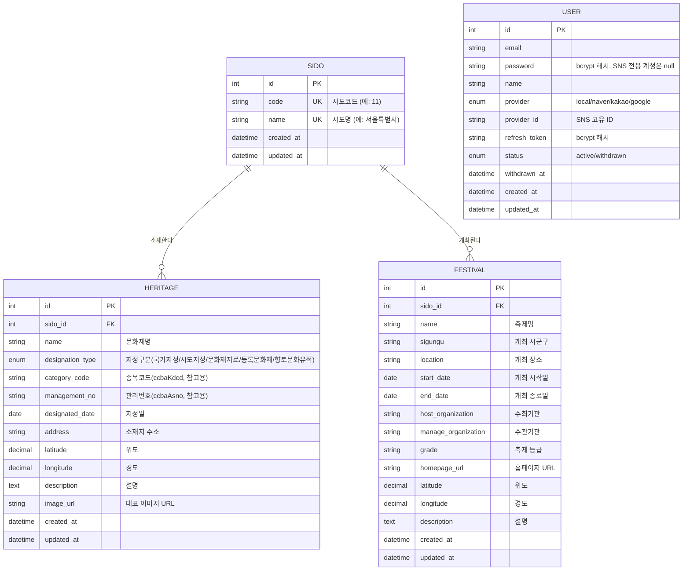

# Project Heritage - ERD

`data.go.kr` 공공데이터포털의 **전국 지정문화재 현황**, **전국문화축제표준데이터** 등의 필드 구성을
참고하여 설계한 데이터베이스 구조입니다. (참고: 국가유산청 Open API 시도코드 `ccbaCtcd`)

- **Sido**: 광역시도 마스터 (국가유산청 Open API 시도코드 기준 17개 고정 데이터)
- **Heritage**: 문화재(국가유산) 정보
- **Festival**: 지역축제 정보
- **User**: 회원 (이전에 구현한 인증 도메인, 문화재/축제와 직접적인 FK 관계는 없음)

GitHub에서는 아래 Mermaid 코드 블록이 다이어그램으로 자동 렌더링됩니다.

## 관계 설명

| 관계 | 설명 |
| --- | --- |
| Sido 1 : N Heritage | 하나의 시도에 여러 문화재가 소속된다. |
| Sido 1 : N Festival | 하나의 시도에서 여러 지역축제가 개최된다. |
| User | 현재 Heritage/Festival과 직접적인 연관관계는 없다. (추후 "관심 축제/문화재 즐겨찾기" 등 확장 시 User-Festival, User-Heritage 다대다 관계 추가 가능) |

## 설계 근거 (PDF 자료 매핑)

| 테이블 | 참고한 공공데이터셋 | 주요 매핑 필드 |
| --- | --- | --- |
| Sido | 국가유산 Open API 시도코드(`ccbaCtcd`) 표 | `code`, `name` |
| Heritage | 국가유산청_전국 지정문화재 현황 Open API, 국가유산청_문화재 공간 정보 Open API | 명칭→`name`, 지정일→`designated_date`, 소재 시도→`sido_id`, 좌표→`latitude`/`longitude`, 설명→`description` |
| Festival | 전국문화축제표준데이터, 문화체육관광부_연도별 지역축제 현황 | 축제명→`name`, 개최장소→`location`, 기간→`start_date`/`end_date`, 주최기관→`host_organization`, 홈페이지→`homepage_url`, 위도·경도→`latitude`/`longitude` |

> 공공데이터포털 Open API 응답 필드는 데이터셋마다 조금씩 다를 수 있으므로, 실제 연동 시
> `categoryCode`/`managementNo`처럼 원본 API 고유 필드를 별도 컬럼으로 보관해두면
> 추후 재동기화(재수집) 시 원본 레코드와 매칭하기 용이합니다.
