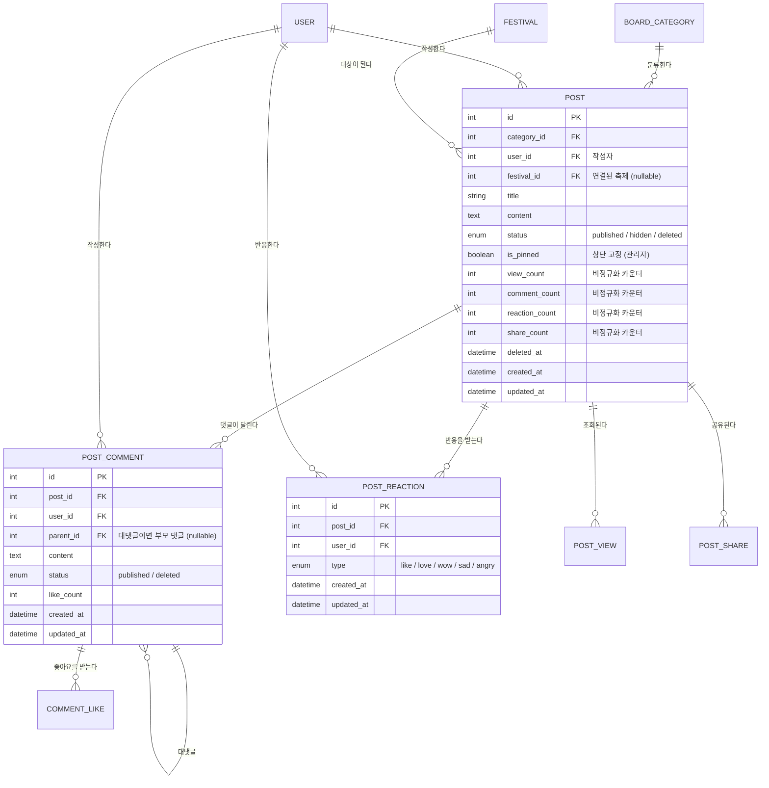

# 커뮤니티 기능 설계안 (구현 전 검토용)

요청 범위는 아래 세 가지입니다.

1. 게시글 관리 (CRUD)
2. 게시글 좋아요 / 공유 / 댓글 / 공감 등 부가기능
3. 커뮤니티 대시보드

이 문서는 **코드를 쓰기 전에 결정해야 할 것들**을 정리한 설계안입니다.
확정되면 `src/migrations/` → 모델 → 서비스 → 라우트 → 테스트 → Flutter 순서로 구현합니다.

---

## 1. 이 앱에서 커뮤니티가 왜 필요한가

지금 서비스는 "축제/문화재를 **찾는**" 기능(캘린더, 둘러보기, 위시리스트, 일정)까지 와 있습니다.
커뮤니티를 일반 게시판으로 만들면 기존 도메인과 따로 놀게 되므로,
**축제와 연결되는 게시판**으로 설계하는 것을 전제로 합니다.

- 게시글은 `festival_id`를 **선택적으로** 가질 수 있다. (nullable FK)
- 축제 상세 화면 하단에 "이 축제 후기 N개"가 붙는다.
- 자유 글은 `festival_id = NULL`로 그냥 쓴다.

이 한 줄짜리 결정이 커뮤니티를 부가기능이 아니라 서비스의 축으로 만듭니다.

---

## 2. 게시판 카테고리

ENUM이 아니라 **마스터 테이블(`board_categories`)** 로 만듭니다.

| 이유 | 설명 |
| --- | --- |
| 운영 편의 | 게시판을 하나 추가할 때마다 마이그레이션을 돌리지 않아도 된다 |
| 정책 분리 | 카테고리별로 "관리자만 쓰기 가능", "축제 연결 필수" 같은 속성을 컬럼으로 둘 수 있다 |

초기 시드 데이터 (Sido와 동일하게 마이그레이션에서 심습니다):

| code | name | 특성 |
| --- | --- | --- |
| `notice` | 공지사항 | 관리자만 작성 (`write_role = 'admin'`) |
| `free` | 자유게시판 | 누구나 |
| `review` | 축제 후기 | 축제 연결 **필수** (`require_festival = true`) |
| `companion` | 동행 구해요 | 축제 연결 권장 |
| `question` | 질문/답변 | 누구나 |

---

## 3. 데이터 모델

### 3.1 추가되는 테이블 (7개)

| 테이블 | 역할 |
| --- | --- |
| `board_categories` | 게시판 마스터 |
| `posts` | 게시글 |
| `post_comments` | 댓글 / 대댓글 (self FK) |
| `post_reactions` | 좋아요 + 공감 (통합) |
| `comment_likes` | 댓글 좋아요 |
| `post_views` | 조회수 중복 방지용 로그 |
| `post_shares` | 공유 로그 |

Phase 4에서 `post_reports`(신고), `post_images`(이미지 첨부)가 추가됩니다.

### 3.2 ERD (추가분)



---

## 4. 설계 결정 사항 (검토 필요)

여기가 이 문서의 핵심입니다. **결정이 갈리면 나중에 갈아엎어야 하는 것들**만 모았습니다.

### 결정 1. "좋아요"와 "공감"을 한 테이블로 볼 것인가

요청에 좋아요와 공감이 따로 적혀 있어서 두 가지 해석이 가능합니다.

| 안 | 구조 | 사용자 경험 |
| --- | --- | --- |
| **A (권장)** | `post_reactions` 하나 + `type` ENUM. `(user_id, post_id)` UNIQUE | 페이스북 방식. 한 사람이 글 하나에 **반응 하나**. 좋아요를 눌렀다가 "슬퍼요"로 바꾸면 갈아탄다 |
| B | `post_likes` + `post_reactions` 별도 테이블 | 좋아요를 누르고 **동시에** 공감 이모지도 남길 수 있다 |

**A를 권장합니다.** B는 "좋아요 12 / 공감 8"이 무슨 뜻인지 사용자가 해석하기 어렵고,
인기글 정렬 기준도 둘로 쪼개집니다. A는 `type='like'`가 곧 좋아요이고,
집계는 `reaction_count`(전체) + 타입별 분포를 같이 내려주면 UI에서 둘 다 표현할 수 있습니다.

> A로 시작해도 B로 갈아타는 건 테이블 추가라 어렵지 않지만, 그 반대는 데이터 병합이 필요합니다.

### 결정 2. 댓글 깊이

**1단계까지만(댓글 → 대댓글) 허용을 권장합니다.**
대댓글에 다시 답글을 달면 `parent_id`를 **최상위 댓글로 고정**하고 본문에 멘션만 남깁니다.
무한 depth는 모바일 화면에서 들여쓰기가 감당이 안 되고, 조회 쿼리가 재귀로 갑니다.

삭제된 댓글은 **행을 지우지 않고** `status='deleted'`로 두고 "삭제된 댓글입니다"로 표시합니다.
자식 대댓글이 붙어 있는 댓글을 물리 삭제하면 대화 맥락이 끊기기 때문입니다.

### 결정 3. 카운터를 비정규화할 것인가

**비정규화(권장).** `posts.reaction_count`, `comment_count`, `view_count`, `share_count`를 컬럼으로 둡니다.

- 이유: 인기글 정렬(`ORDER BY reaction_count DESC`)에 인덱스를 태울 수 있습니다.
  매번 `COUNT(*)` + `JOIN`으로 정렬하면 글이 늘어날수록 목록 API가 그대로 느려집니다.
- 위험: 원본과 카운터가 어긋날 수 있음.
- 대책 1: 반응/댓글 생성·삭제를 **트랜잭션 안에서 카운터 증감과 같이** 처리합니다.
- 대책 2: `npm run community:recount` 스크립트로 실제 값과 대조·보정합니다. (기존 `admin:grant` 스크립트와 같은 방식)
- 대책 3: 테스트에서 "댓글 3개 달고 1개 지우면 `comment_count`가 2" 를 검증합니다.

### 결정 4. 조회수를 어떻게 셀 것인가

상세 조회할 때마다 +1 하면 새로고침으로 숫자가 부풀고 인기글 순위가 오염됩니다.

**`post_views` 테이블로 하루 1회만 집계를 권장합니다.**
- 로그인 사용자: `(post_id, user_id, view_date)` UNIQUE → 하루에 한 번만 카운트
- 비로그인 사용자: `(post_id, ip_hash, view_date)` UNIQUE (IP는 해시로 저장, 원문 저장 안 함)
- 본인 글 조회는 카운트하지 않음
- 로그가 쌓이므로 90일 지난 행은 배치로 정리 (기존 `node-cron` 잡에 추가)

### 결정 5. 공유를 서버에 기록할 것인가

**기록을 권장합니다.** `POST /api/community/posts/:id/share`로 `post_shares`에 로그를 남기고
`share_count`를 올립니다. (같은 사람이 여러 번 공유할 수 있으므로 UNIQUE 없음)

- 채널(`kakao`/`link`/`etc`)을 남기면 어떤 경로로 유입되는지 알 수 있습니다.
- 딥링크만 쓰고 서버 기록을 안 하면 공유 수가 대시보드에 나올 수 없습니다.
- 단, 이건 **클라이언트가 자진 신고하는 값**이라 정확한 지표가 아니라는 점은 분명히 해둡니다.
  (실제 유입은 나중에 딥링크 파라미터로 따로 봐야 합니다)

### 결정 6. 삭제 정책

`posts.status ENUM('published','hidden','deleted')` + `deleted_at` — 기존 `users.status` 패턴과 동일합니다.

- `deleted`: 작성자가 지움. 목록/상세에서 안 보임.
- `hidden`: 관리자가 블라인드 처리. 작성자에게는 "신고로 숨김 처리된 글" 로 보임.
- 물리 삭제는 하지 않습니다. 신고 처리 이력과 통계가 같이 날아가기 때문입니다.

---

## 5. API 설계

전부 `/api/community` 하위로 모읍니다. 기존 미들웨어를 그대로 씁니다.
목록/상세는 `optionalAuthenticate`를 써서 **로그인했으면 `myReaction`, `isMine` 플래그를 같이 내려줍니다.**
(축제 목록에서 `isWishlisted`를 내려주는 것과 같은 방식)

### 5.1 게시글

| Method | Path | 인증 | 설명 |
| --- | --- | --- | --- |
| GET | `/api/community/categories` | - | 게시판 목록 |
| GET | `/api/community/posts` | optional | 목록. `category`, `festivalId`, `sort`(latest/popular), `keyword`, `page`, `limit` |
| GET | `/api/community/posts/:id` | optional | 상세 (+조회수 집계) |
| POST | `/api/community/posts` | 필수 | 작성 (`notice` 카테고리는 관리자만) |
| PUT | `/api/community/posts/:id` | 필수 | 수정 (작성자 본인만) |
| DELETE | `/api/community/posts/:id` | 필수 | 삭제 (작성자 또는 관리자) |
| PATCH | `/api/community/posts/:id/pin` | 관리자 | 상단 고정 토글 |
| PATCH | `/api/community/posts/:id/hide` | 관리자 | 블라인드 처리 |

### 5.2 댓글

| Method | Path | 인증 | 설명 |
| --- | --- | --- | --- |
| GET | `/api/community/posts/:id/comments` | optional | 댓글+대댓글 (부모 기준 정렬) |
| POST | `/api/community/posts/:id/comments` | 필수 | 댓글 작성 (`parentId` 주면 대댓글) |
| PUT | `/api/community/comments/:id` | 필수 | 수정 (본인만) |
| DELETE | `/api/community/comments/:id` | 필수 | 삭제 (본인 또는 관리자) |
| POST | `/api/community/comments/:id/like` | 필수 | 댓글 좋아요 토글 |

### 5.3 반응 / 공유

| Method | Path | 인증 | 설명 |
| --- | --- | --- | --- |
| PUT | `/api/community/posts/:id/reaction` | 필수 | 반응 등록/변경 (`{ "type": "like" }`) |
| DELETE | `/api/community/posts/:id/reaction` | 필수 | 반응 취소 |
| POST | `/api/community/posts/:id/share` | 필수 | 공유 기록 (`{ "channel": "kakao" }`) |

> 좋아요를 `POST .../like` 토글이 아니라 `PUT .../reaction`으로 둔 이유:
> "좋아요 → 슬퍼요" 변경이 토글 API로는 표현되지 않기 때문입니다.
> 프론트에서 하트 버튼은 `PUT {type:'like'}` / `DELETE`로 토글하면 됩니다.

### 5.4 대시보드 / 내 활동

| Method | Path | 인증 | 설명 |
| --- | --- | --- | --- |
| GET | `/api/community/dashboard` | optional | 아래 5.5 참고 |
| GET | `/api/community/me/posts` | 필수 | 내가 쓴 글 |
| GET | `/api/community/me/comments` | 필수 | 내가 쓴 댓글 |
| GET | `/api/community/me/reactions` | 필수 | 내가 반응한 글 |

### 5.5 대시보드에 무엇을 담을 것인가

"대시보드"가 가장 모호한 항목이라 아래로 정의합니다. 한 번의 요청으로 커뮤니티 홈을 다 그립니다.

```jsonc
{
  "trending":   [ /* 최근 7일 인기글 5개 */ ],
  "latest":     [ /* 전체 최신글 5개 */ ],
  "categories": [ { "code": "review", "name": "축제 후기", "postCount": 128, "todayCount": 4 } ],
  "festivalTalk": [ /* 지금 진행 중인 축제 중 글이 많은 축제 3개 */ ],
  "myActivity": { "postCount": 3, "commentCount": 12, "receivedReactionCount": 40 } // 로그인 시에만
}
```

**인기글 점수 산식** (7일 이내 글 대상, 실시간 계산):

```
score = reaction_count * 3 + comment_count * 2 + view_count * 0.1
```

- 저장 컬럼으로 두지 않고 조회 시 계산합니다. 대상이 "최근 7일 글"로 제한되어 행 수가 적고,
  가중치를 바꿀 때 재계산 배치가 필요 없기 때문입니다.
- 글이 많아져서 느려지면 그때 `trending_score` 컬럼 + 배치로 옮깁니다. (지금 하면 조기 최적화)
- `festivalTalk`은 기존 축제 도메인과 커뮤니티를 잇는 부분이라 대시보드의 차별점이 됩니다.

---

## 6. 권한 정책

기존 `authenticate` / `optionalAuthenticate` / `requireAdmin` 미들웨어를 그대로 씁니다.

| 행위 | 비로그인 | 회원 | 작성자 | 관리자 |
| --- | --- | --- | --- | --- |
| 목록/상세 조회 | O | O | O | O |
| 글 작성 | X | O | - | O |
| 공지 작성 | X | X | - | O |
| 글 수정 | X | X | O | X (수정은 관리자도 못 함) |
| 글 삭제 | X | X | O | O |
| 블라인드/고정 | X | X | X | O |
| 댓글 작성 | X | O | - | O |

> 관리자에게 **수정 권한을 주지 않는** 이유: 남의 글 내용을 바꿀 수 있으면 그 자체가 사고 원인입니다.
> 문제 있는 글은 고치는 게 아니라 숨기는 게 맞습니다.

권한은 JWT 클레임이 아니라 **매 요청 DB에서 확인**합니다. (기존 `requireAdmin`과 동일한 이유 — 권한 회수가 즉시 반영되어야 함)

---

## 7. 알림 연동

기존 `Notification` 모델을 재사용합니다. `type` ENUM에 값을 추가하는 마이그레이션이 필요합니다.

| type | 발생 시점 | dedupeKey |
| --- | --- | --- |
| `post_comment` | 내 글에 댓글이 달림 | `post_comment:{commentId}` |
| `comment_reply` | 내 댓글에 대댓글이 달림 | `comment_reply:{commentId}` |
| `post_reaction` | 내 글이 반응을 받음 (묶어서 하루 1회) | `post_reaction:{postId}:{yyyymmdd}` |

- 본인이 자기 글에 댓글을 달면 알림을 만들지 않습니다.
- 반응 알림은 건건이 보내면 시끄러우므로 **하루 단위로 묶습니다.** ("회원님의 글에 좋아요 5개")
- `Notification.festivalId`만으로는 게시글로 이동할 수 없으므로 `postId` 컬럼 추가가 필요합니다. (nullable)

---

## 8. Flutter 화면

| 파일 | 역할 |
| --- | --- |
| `screens/community/community_home_screen.dart` | 대시보드 (인기글/최신글/카테고리/축제별 이야기) |
| `screens/community/post_list_screen.dart` | 카테고리별 목록 + 검색 + 정렬 + 무한스크롤 |
| `screens/community/post_detail_screen.dart` | 본문 + 반응 바 + 댓글 트리 + 공유 |
| `screens/community/post_editor_screen.dart` | 작성/수정 공용 (축제 연결 선택 포함) |
| `screens/mypage/my_activity_screen.dart` | 내 글 / 내 댓글 / 내 반응 탭 |

기존 화면 수정:
- `festival_detail_screen.dart`: 하단에 "이 축제 후기" 섹션 + 후기 쓰기 버튼 (`festivalId` 프리셋)
- `home_screen.dart`: 커뮤니티 진입점 추가
- `notification_screen.dart`: 알림 타입에 따라 축제 상세 / 게시글 상세로 분기

모델: `post_model.dart`, `comment_model.dart`, `reaction_model.dart`, `community_dashboard_model.dart`
서비스: `community_service.dart`

---

## 9. 구현 순서

| 단계 | 범위 | 산출물 |
| --- | --- | --- |
| ~~**1**~~ | ~~마이그레이션 + 모델 7개 + 카테고리 시드~~ | ✅ 완료 (`99f57cd`) |
| ~~**2**~~ | ~~게시글 CRUD + 목록/상세/검색/권한 + 조회수~~ | ✅ 완료 — `community.test.js` 47개 |
| ~~**3**~~ | ~~댓글/대댓글 + 반응 + 공유 + 카운터 트랜잭션~~ | ✅ 완료 — `communityInteraction.test.js` 37개 |
| ~~**4**~~ | ~~대시보드 + 내 활동 + 알림 연동~~ | ✅ 완료 — `communityDashboard.test.js` 28개 |
| ~~**5**~~ | ~~Flutter 화면 5개 + 기존 화면 연결~~ | ✅ 완료 — 테스트 60개, 계약 테스트가 버그 2건 발견 |
| **6** | (선택) 신고·차단·이미지 첨부 | `post_reports`, `user_blocks`, `post_images` |

각 단계는 그 단계만으로 동작하는 상태로 커밋합니다.
스키마는 **모델과 마이그레이션을 항상 같이** 바꿔야 하며, 어긋나면 `npm test`가 실패합니다. (기존 드리프트 테스트)

---

## 10. 테스트 계획

기존 156개 백엔드 테스트에 더해 대략 60~70개를 예상합니다.

- **권한**: 남의 글 수정 403, 비회원 작성 401, 공지 카테고리에 일반 회원 작성 403, 관리자 삭제 200
- **카운터 정합성**: 댓글 3개 → 1개 삭제 → `comment_count = 2`, 반응 변경 시 총합 불변
- **반응 전환**: `like` → `sad` 로 바꿔도 행이 1개이고 총 반응 수가 1
- **조회수**: 같은 사용자가 같은 날 3번 봐도 +1, 본인 글은 +0
- **대댓글**: 대댓글에 단 답글의 `parentId`가 최상위로 고정되는지
- **삭제된 댓글**: 자식이 있으면 행이 남고 내용만 가려지는지
- **알림**: 자기 글에 자기가 댓글 → 알림 없음, 반응 알림이 하루에 1건으로 묶이는지
- **대시보드**: 7일 지난 글은 인기글에서 빠지는지, 비로그인은 `myActivity`가 없는지

---

## 11. 지금 결정이 필요한 것

| # | 질문 | 권장안 |
| --- | --- | --- |
| 1 | 좋아요와 공감을 하나로 볼 것인가 | **하나 (`post_reactions` + type)** |
| 2 | 댓글 깊이 | **1단계까지 (대댓글까지)** |
| 3 | 조회수 중복 방지 | **하루 1회 집계 (`post_views`)** |
| 4 | 공유를 서버에 기록 | **기록함 (`post_shares`)** |
| 5 | 게시글에 이미지 첨부 | Phase 6으로 미룸 (지금 넣으면 스토리지 이슈까지 딸려옴) |
| 6 | 신고/차단 | Phase 6으로 미룸 |
| 7 | 어디까지 이번에 만들 것인가 | **1~5단계 (신고·이미지 제외)** |

> 참고: 이미지 첨부를 넣는다면 프로필 이미지와 같은 로컬 디스크 저장 방식이 됩니다.
> 이건 이미 알려드린 대로 **서버가 여러 대가 되는 순간 깨지는 구조**라,
> S3 같은 외부 스토리지로 옮기는 작업과 같이 하는 게 맞습니다.
